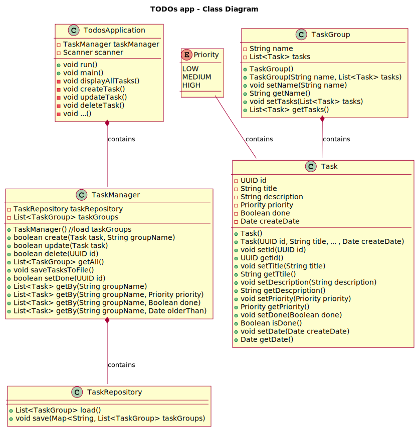

# TODOs
<!-- ALL-CONTRIBUTORS-BADGE:START - Do not remove or modify this section -->
[](#contributors-)
<!-- ALL-CONTRIBUTORS-BADGE:END -->

[](https://www.java.com/en/)
[](https://kotlinlang.org/)


An application that allows users to create and manage a to-do list.

## Task
**Required Features:**

The user should be able to create a new task and assign a description and priority to it.
The user should be able to mark the task as done.
The user should have an overview of all tasks and their status (completed/incomplete).
The user should be able to edit or delete an existing task.
The application should allow saving task data to a file so that it can be retrieved the next time it is run.

**Possible extensions:**

Add the ability to filter tasks by priority, creation date, or status.
Implement alerts (e.g. through notifications) for upcoming task deadlines.
Allow users to create and manage to-do lists (eg personal, work, school).

When creating a project, you can try creating classes for representing tasks, managing collections, working with inputs and outputs, and other basic Java concepts. You can also use OOP principles as I mentioned earlier and implement classes like Task to represent a single task and TaskManager to manage a list of tasks.

## Architecture


## How to run
```bash
cd java
mvn compile exec:java
```

## Useful links
* [planttext uml online editor](https://www.planttext.com/)

## Contributors
<!-- ALL-CONTRIBUTORS-LIST:START - Do not remove or modify this section -->
<!-- prettier-ignore-start -->
<!-- markdownlint-disable -->
<table>
  <tr>
     <td align="center"><a href="https://github.com/GeorgeFreelanceDeveloper"><br /><sub><b>GeorgeFreelanceDeveloper<br>GeorgeQuantAnalyst</b></sub></a><br /><a href="https://github.com/GeorgeQuantAnalyst" title="Ideas">🤔</a></td>
    <td align="center"><a href="https://github.com/LucyFreelanceDeveloper"><br /><sub><b>LucyFreelanceDeveloper<br>LucyQuantAnalyst</b></sub></a><br /><a href="https://github.com/LucyQuantAnalyst" title="Code">💻</a></td>
  </tr>
</table>
